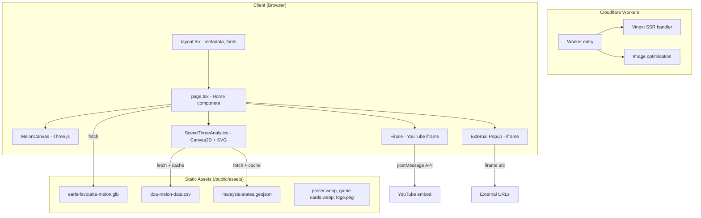
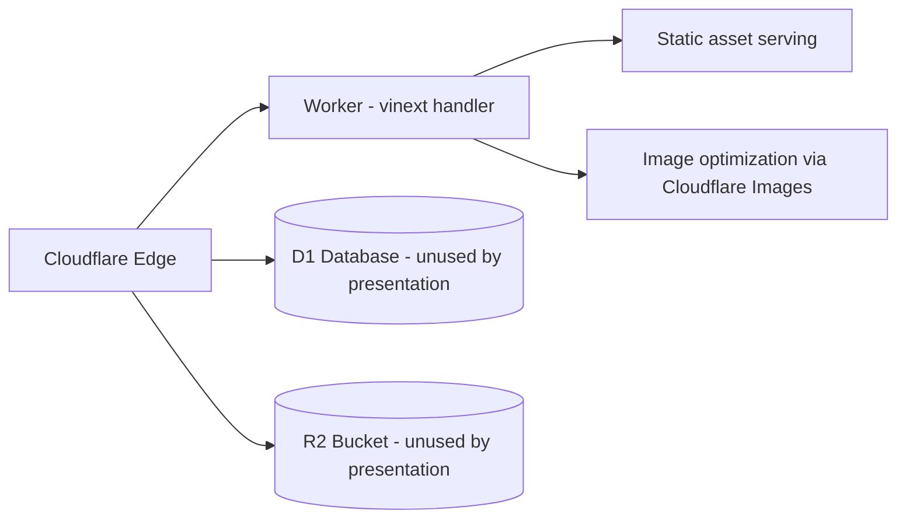

# Design Document: FAMA Melon Presentation

## Overview

A single-page immersive web presentation ("What Do You See In A Melon?") for FAMA Malaysia, designed for live presenter operation at MAHA 2026. The application uses seven sequential scenes to reframe a melon from physical object through data, analytics, theme, interaction, participation, and lived experience.

The presentation is a monolithic client-side React 19 application deployed on Cloudflare Workers via Vinext/Vite. It combines Three.js 3D rendering, Canvas 2D geographic visualisation, SVG charting, CSS-driven transitions, and iframe-embedded external experiences into a single route with keyboard-first navigation.

**Key Design Decisions:**
- **Single component architecture**: One large `"use client"` component (`app/page.tsx`) owns all state to simplify scene transitions and avoid prop drilling across 7 tightly-coupled scenes.
- **No animation library**: CSS keyframe animations and transitions handle all motion — reduces bundle size and leverages GPU compositing.
- **Module-level caching**: Data fetches (CSV, GeoJSON) use module-scoped promises to guarantee single-parse-per-session without React state complexity.
- **Presenter-first UX**: Keyboard shortcuts take priority; the interface assumes a confident operator in a live event context.

## Architecture



### Deployment Architecture



The worker (`worker/index.ts`) handles two concerns:
1. **Image optimisation** — proxies `/_vinext/image` requests through Cloudflare Images with allowed width sets.
2. **App routing** — delegates all other requests to the Vinext server-side handler.

D1 and R2 bindings exist in the config but are not consumed by the presentation logic.

## Components and Interfaces

### Component Tree

```
RootLayout (server component - layout.tsx)
└── Home (client component - page.tsx)
    ├── MelonCanvas (Three.js renderer)
    ├── SceneThreeAnalytics (data visualisation)
    │   ├── MalaysiaMetricMap (Canvas 2D)
    │   └── ProductionTrend (SVG)
    ├── External Popup (inline JSX)
    ├── Finale Player (inline JSX)
    ├── Scene Menu (inline JSX)
    └── Navigation UI (inline JSX)
```

### Home Component (page.tsx)

The root client component manages all presentation state:

| State | Type | Purpose |
|-------|------|---------|
| `active` | `number` | Current scene index (0–6) |
| `menuOpen` | `boolean` | Slide-out scene menu visibility |
| `externalPopup` | `{title, url} \| null` | External iframe popup |
| `externalReady` | `boolean` | Iframe load completion |
| `finale` | `boolean` | YouTube finale overlay active |
| `finaleVideoReady` | `boolean` | YouTube player loaded |
| `finaleTransitioning` | `boolean` | Poster-to-video animation state |
| `fullscreen` | `boolean` | Browser fullscreen state |
| `scanning` | `boolean` | Scan animation in progress |
| `scanConfirmed` | `boolean` | "SCAN COMPLETE" overlay visible |
| `scanComplete` | `boolean` | Scan has completed at least once |
| `cursor` | `{x, y}` | Custom cursor position |

**Key callbacks:**
- `go(next)` — Central navigation function. Enforces scan-to-enter-scene-2 rule, launches finale from scene 7.
- `runScan()` — Initiates holographic scan sequence with timed state transitions (2100ms scan, 2850ms confirmation).
- `launchFinale()` / `closeFinale()` — YouTube player control via postMessage API.
- `openExternalPopup(title, url)` — Opens themed iframe overlay.

### MelonCanvas Component

Encapsulated Three.js lifecycle within a React component:

- **Renderer**: WebGLRenderer with alpha, antialias, `powerPreference: "high-performance"`, pixel ratio capped at 2.
- **Scene graph**: Camera (32° FOV) → Group (melon + scan shell) + Lights + Particles.
- **Model loading**: GLTFLoader loads GLB, auto-centres via bounding box, scales to fit 3.45 units.
- **Scan wireframe**: Cloned mesh at 1.003× scale with custom GLSL shader (additive blending, travelling energy band via `sin(uTime)`).
- **Lighting**: HemisphereLight (0xcaffed/0x101008, 2.1) + DirectionalLight key (warm, 4.2) + DirectionalLight rim (mint, 3.3).
- **Particles**: 520 points distributed in a spherical shell (radius 2.4–6.2), rotating at 0.009 rad/s.
- **Lifecycle**: Renders when `active` prop is true; idles with 180ms setTimeout when inactive. Full disposal on unmount (geometries, materials, textures, renderer, DOM element).

### SceneThreeAnalytics Component

Self-contained data visualisation module:

- **Data loading**: Module-level promises (`malaysiaFeaturesPromise`, `melonRowsPromise`) ensure single fetch/parse per session.
- **CSV parser** (`parseCsv`): Strips BOM, splits lines, maps columns to typed `RecordRow` objects.
- **State**: year (2024), commodity ("ALL"), selected state ("JOHOR"), popup mode ("map" | "trend" | null).
- **Derived data** (via `useMemo`):
  - `filtered` — rows matching current year + commodity
  - `stateMetrics` — Map<state, Metric> aggregation
  - `overviewMetrics` — Map<state, Metric> for 2024 all varieties
  - `overviewBreakdown` — Map<state, Map<commodity, production>> for label boxes
  - `districts` — sorted district list for selected state

### MalaysiaMetricMap (Canvas 2D)

- Loads GeoJSON features asynchronously.
- Projects coordinates with a simplified Mercator: `project([lon, lat])` shifts Borneo states (lon > 108) by -3.2° west for visual compactness.
- Renders state polygons with production-intensity fill (sqrt scaling).
- In compact mode: draws connected label boxes with variety breakdown per state, grouped by geographic region.
- Provides hit detection via point-in-polygon for interactive state selection.
- Re-draws on resize and data changes.

### ProductionTrend (SVG)

- Computes 3 series (TEMBIKAI, TEMBIKAI SUSU, TEMBIKAI WANGI) across unique years.
- Renders polylines within a padded SVG viewBox.
- Hover interaction: crosshair line, data point circles, tooltip with year and per-variety figures.
- Compact mode: simplified layout with persistent figures panel (aria-live for screen readers).

## Data Models

### RecordRow (CSV record)

```typescript
type RecordRow = {
  year: number;        // 2011–2024
  commodity: string;   // "TEMBIKAI" | "TEMBIKAI SUSU" | "TEMBIKAI WANGI"
  state: string;       // e.g. "JOHOR", "SABAH"
  district: string;    // e.g. "BATU PAHAT", "TAWAU"
  planted: number;     // hectares
  harvested: number;   // hectares
  production: number;  // metric tonnes
};
```

### Metric (aggregated values)

```typescript
type Metric = {
  planted: number;     // sum of hectares planted
  harvested: number;   // sum of hectares harvested
  production: number;  // sum of metric tonnes produced
};
```

### GeoFeature (map polygon)

```typescript
type GeoFeature = {
  properties: { name: string };                    // state name
  geometry: { coordinates: number[][][][] };       // MultiPolygon coordinates
};
```

### Scene Definition (constant)

```typescript
type SceneDefinition = {
  id: string;       // CSS class suffix
  number: string;   // "01"–"07"
  label: string;    // navigation label
  kicker: string;   // eyebrow text
  title: ReactNode; // headline JSX
  body: string;     // body copy
};
```

### Static Data Files

| File | Format | Size | Content |
|------|--------|------|---------|
| `doa-melon-data.csv` | CSV | ~45KB | 14 years × 3 varieties × 14 states × ~145 districts |
| `malaysia-states.geojson` | GeoJSON | ~180KB | State boundary polygons |
| `earls-favourite-melon.glb` | GLB/glTF | ~8MB | PBR melon model with 2048px textures |

## Correctness Properties

*A property is a characteristic or behavior that should hold true across all valid executions of a system — essentially, a formal statement about what the system should do. Properties serve as the bridge between human-readable specifications and machine-verifiable correctness guarantees.*

### Property 1: CSV parsing preserves data integrity

*For any* valid CSV row containing numeric values for year, planted, harvested, and production fields, the `parseCsv` function SHALL produce a `RecordRow` object where each numeric field equals the original value and each string field matches the original text.

**Validates: Requirements 5.2, 15.1**

### Property 2: State aggregation correctness

*For any* set of `RecordRow` records and any year/commodity filter combination, the aggregated `Metric` for a given state SHALL have its `production` field equal to the sum of `production` values from all records matching that state, year, and commodity.

**Validates: Requirements 5.3, 15.1**

### Property 3: Trend series computation correctness

*For any* set of `RecordRow` records and any commodity, the annual production series value for a given year SHALL equal the sum of `production` values from all records matching that year and commodity.

**Validates: Requirements 5.5, 15.1**

## Error Handling

### Asset Loading

- **GLB model failure**: The GLTFLoader `load` callback is fire-and-forget; if loading fails, the canvas renders an empty scene with particles and lights. No error UI is shown (acceptable for a controlled presentation environment).
- **CSV/GeoJSON failure**: Fetch failures are caught and logged to console. The analytics view renders with empty data (no map polygons, no chart series). Module-level promises prevent retry on subsequent renders.
- **Game/Dashboard iframes**: External URLs may fail to load. The External_Popup shows a loading spinner indefinitely until the iframe fires `onLoad`. No timeout fallback exists.

### Runtime State

- **Navigation boundaries**: `go()` clamps the target index to [0, 6]. Advancing past scene 7 triggers the finale rather than overflowing.
- **Scan re-entry**: Calling `runScan()` while already scanning is a no-op (early return on `scanning === true`).
- **Finale re-entry**: `launchFinale()` returns early if `finale || finaleTransitioning` is true.
- **Timer cleanup**: All `setTimeout` handles are stored in refs and cleared on unmount via the useEffect cleanup function.
- **Canvas resize**: Resize listeners are attached and cleaned up; canvas dimensions are re-calculated on window resize.

### Graceful Degradation

- **Reduced motion**: `@media (prefers-reduced-motion: reduce)` sets all animation/transition durations to 0.01ms.
- **Missing cursor support**: Custom cursor only renders on `@media(pointer: fine)` devices.
- **Mobile layout**: Viewport ≤ 800px stacks panels, hides decorative elements (side rail, scene dots, HUD corners).

## Testing Strategy

### Unit Tests (Example-Based)

The majority of requirements test UI rendering behavior, navigation state transitions, and visual styling that are best verified with example-based tests:

- **Navigation state machine**: Verify all keyboard shortcuts produce correct scene transitions, including edge cases (scene 2 requires scan, scene 7 advance launches finale).
- **Scan sequence timing**: Mock timers to verify state progression (scanning → scanConfirmed → scanComplete).
- **Finale player control**: Mock `postMessage` to verify correct YouTube API commands on launch/close.
- **Component rendering**: Verify each scene renders correct content elements (poster, game cards, dashboard, analytics).
- **Accessibility attributes**: Verify aria-labels, roles, aria-live regions, and focus indicators.

### Property-Based Tests

For the data processing layer, property-based testing validates universal correctness across the full input space:

- **Library**: [fast-check](https://github.com/dubzzz/fast-check) (TypeScript PBT library)
- **Minimum iterations**: 100 per property
- **Targets**: `parseCsv`, state aggregation logic, trend series computation

Each property test references its design document property:
- **Feature: fama-melon-presentation, Property 1: CSV parsing preserves data integrity**
- **Feature: fama-melon-presentation, Property 2: State aggregation correctness**
- **Feature: fama-melon-presentation, Property 3: Trend series computation correctness**

### Integration Tests

- **Rendered HTML test** (existing at `tests/rendered-html.test.mjs`): Builds the application and validates the output HTML structure.
- **Asset loading**: Verify GLB, CSV, and GeoJSON fetch paths resolve correctly in the build output.

### Visual / Manual Testing

- Scene transitions and CSS animations require visual verification on target projector hardware.
- Canvas 2D map rendering and Three.js model appearance require manual inspection.
- YouTube embed behaviour depends on network and YouTube service availability.
- Responsive layout breakpoints require device/viewport testing.
